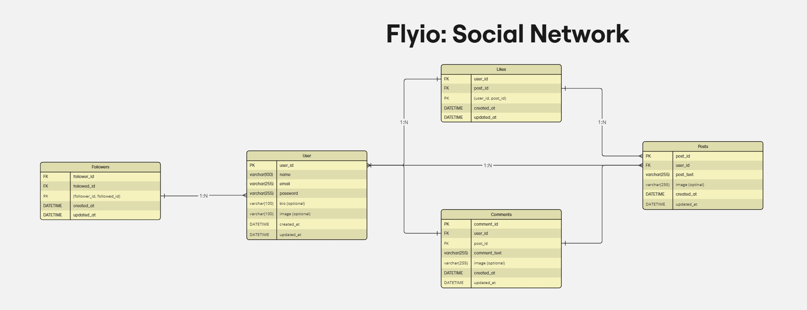

# Flyio - Social Network API

This project involves the development of a social network using the NestJS framework, with a focus on scalability, modularity, and security. The application allows users to create profiles, post content, interact with other posts, and connect with other users. The system also includes common social network features, such as comments and likes.

## 

## ER Model

